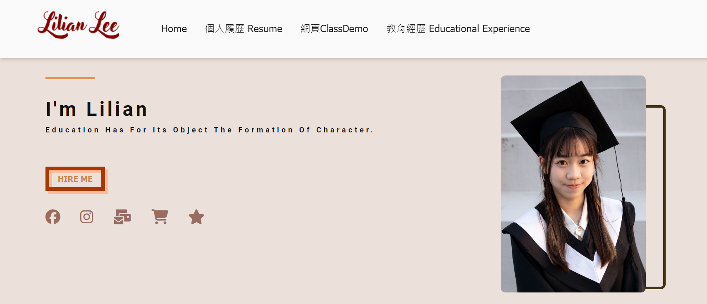
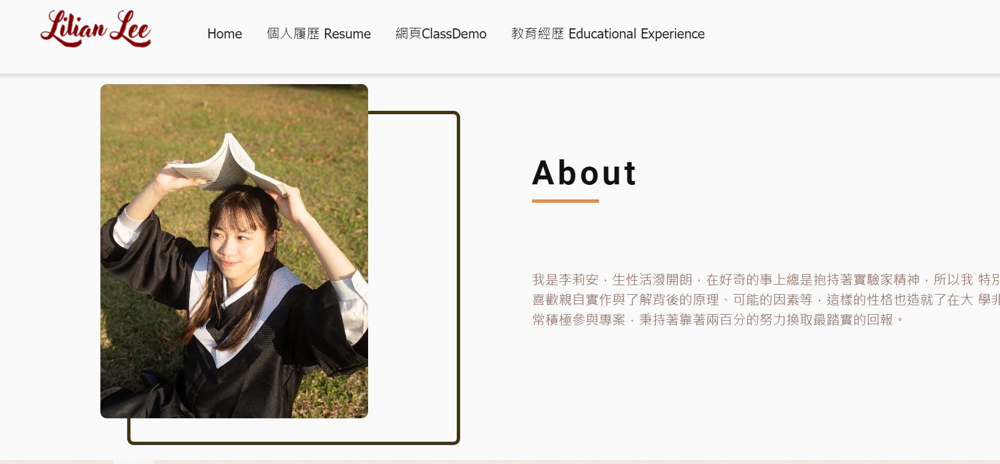
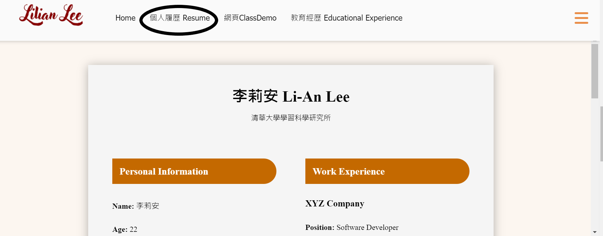
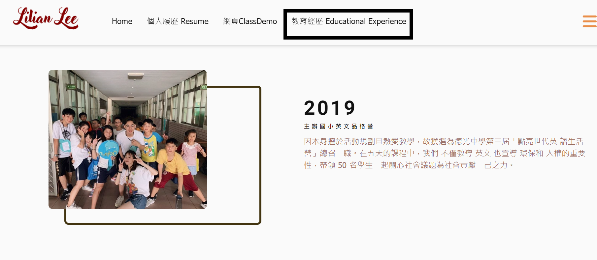
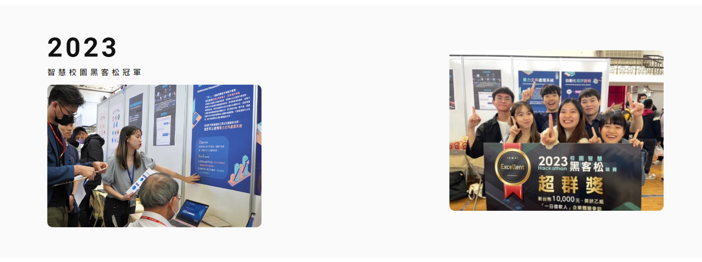
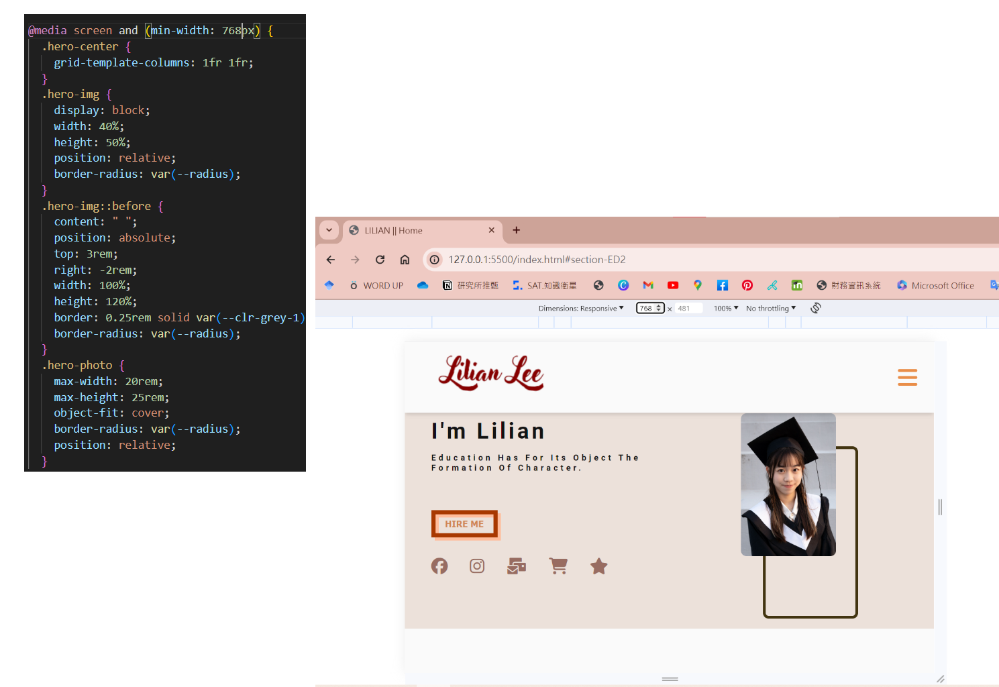
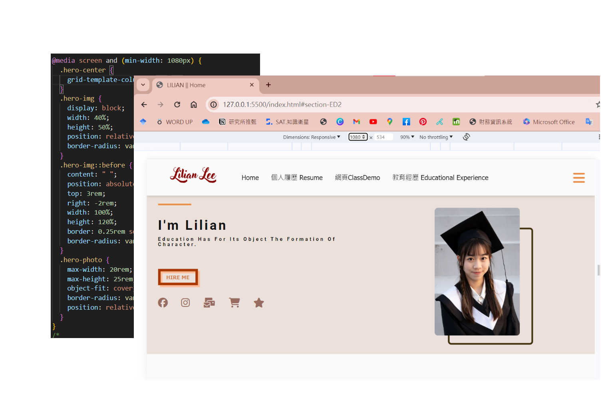
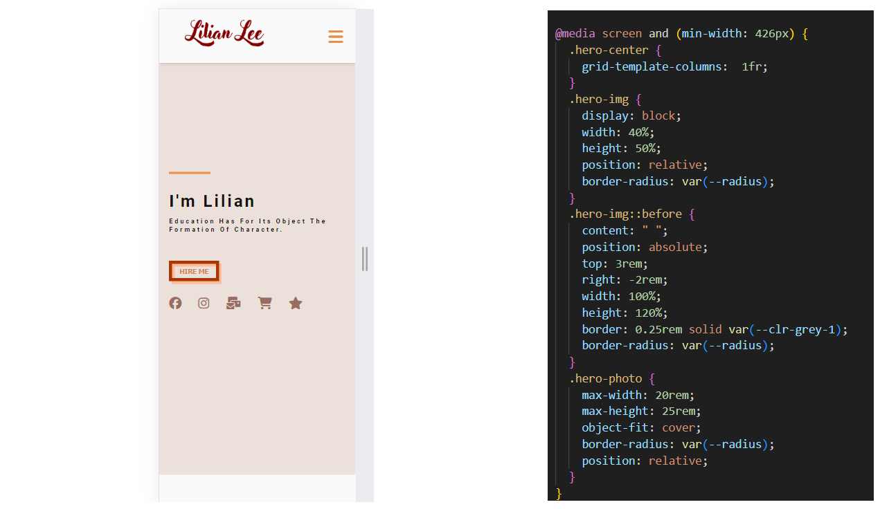

[My Github Repo](https://github.com/lilian71702/1121-web-409730446)

[My Vercel Repo](https://1121-web-409730446.vercel.app/)

### Part 1: 個人化 portfolio (60%)

##### => 期末 project 要有 header, footer, 及 Hero, Resume, Gallery 三項資訊，基本上請放在同一個頁面上，如有特殊需求，可以放在不同的頁面上，但都要出現一樣的 header 及 footer

##### => 請說明 Hero, Resume, Gallery，是如何產出的? 如果有異於老師上課框架，個人有修改過的項目，請說明並附上圖片。任何有參考網路資源部分，請列出其來源。

##### => 如果用老師上課的架構 (html, css, js) 修改，將文字及圖片換成跟自己有關的資訊，有基本分 50%。修改的愈多，分數愈高，但需要詳細以文字及圖片做說明。

#### P1-1: Hero Page (個人主頁)

#### P1-2: Resume (履歷表)

#### P1-3: Gallery (圖片集、作品集)

### Part 2: 響應式網頁 (20%)

##### => 斷點(breakpoint)，至少要有三個以上 (desktop, tablet, phone)，斷點 px 請根據你的設計自行決定

##### => 至少 3 個以上的 section，有些用 breakpoints，有些用 minmax ，要兩個都包含。

#### P2-1:斷點1(768px)
 

---

#### P2-2:斷點1(1080px)

---

#### P2-3:斷點1(428*926px)

---

### Part 3: 上課 class demo (20%)

##### => 每週Demo w1-w16、期中考w11、延伸作品

[My classDemo Repo](https://1121-web-409730446.vercel.app/)
