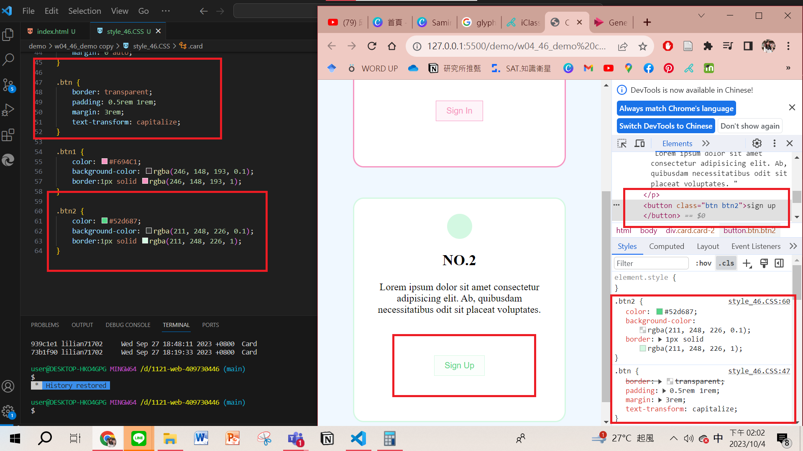
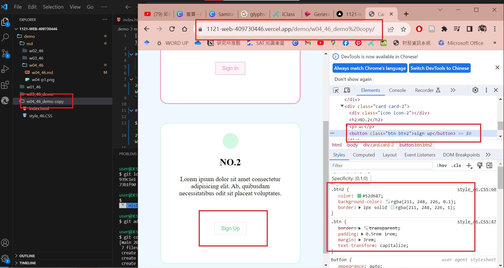
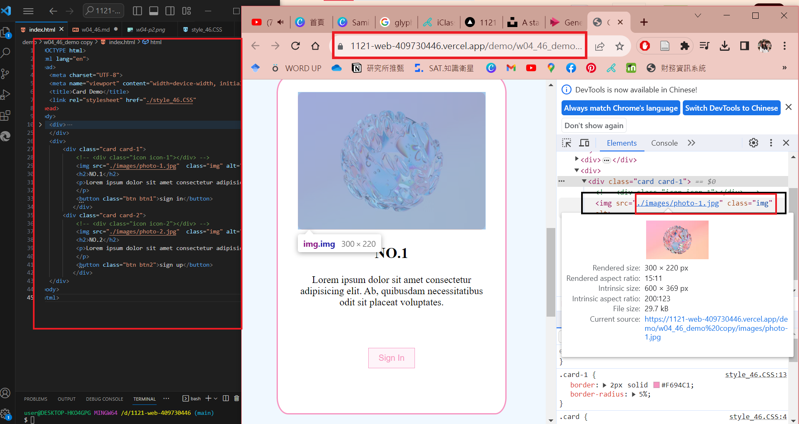
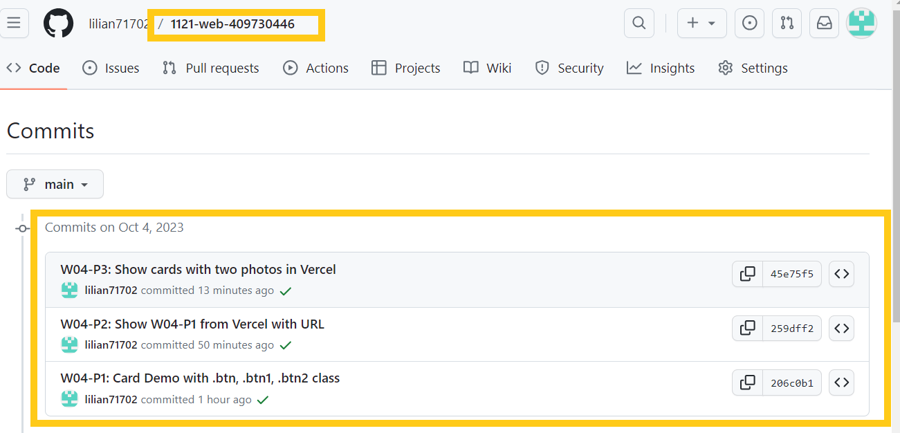

[My Github Repo](https://github.com/lilian71702/1121-web-409730446)

### W04-P1: Card Demo with .btn, .btn1, .btn2 class
 
 

```
206c0b1 lilian71702     Wed Oct 4 14:10:01 2023 +0800   W04-P1: Card Demo with .btn, .btn1, .btn2 class
```

### W04-P2: Show W04-P1 from Vercel with URL
[W04-P2 Vercel URL](https://1121-web-409730446.vercel.app/demo/w04_46_demo%20copy/)



```
259dff2 lilian71702     Wed Oct 4 15:11:40 2023 +0800   W04-P2: Show W04-P1 from Vercel with URL

```

### W04-P3: Show cards with two photos in Vercel
[W04-P3 Vercel URL](https://1121-web-409730446.vercel.app/demo/w04_46_demo%20copy/)



```
45e75f5 lilian71702     Wed Oct 4 15:48:29 2023 +0800   W04-P3: Show cards with two photos in Vercel

```

### W04-git log




```
$ git log --pretty=format:"%h%x09%an%x09%ad%x09%s" --after="2023-10-03"
45e75f5 lilian71702     Wed Oct 4 15:48:29 2023 +0800   W04-P3: Show cards with two photos in Vercel   
259dff2 lilian71702     Wed Oct 4 15:11:40 2023 +0800   W04-P2: Show W04-P1 from Vercel with URL       
206c0b1 lilian71702     Wed Oct 4 14:10:01 2023 +0800   W04-P1: Card Demo with .btn, .btn1, .btn2 class

```
