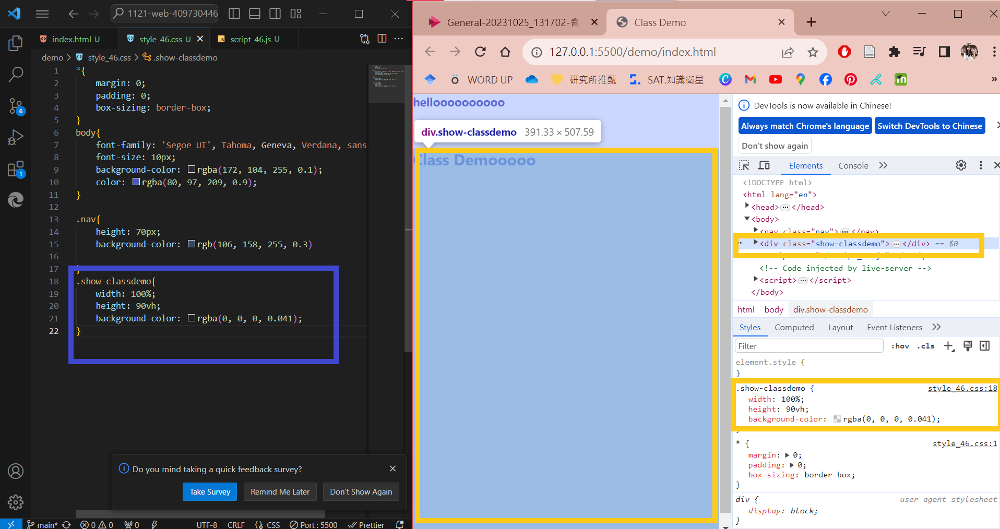
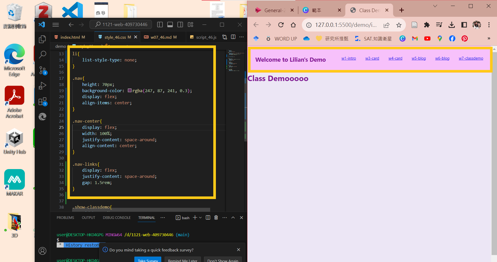
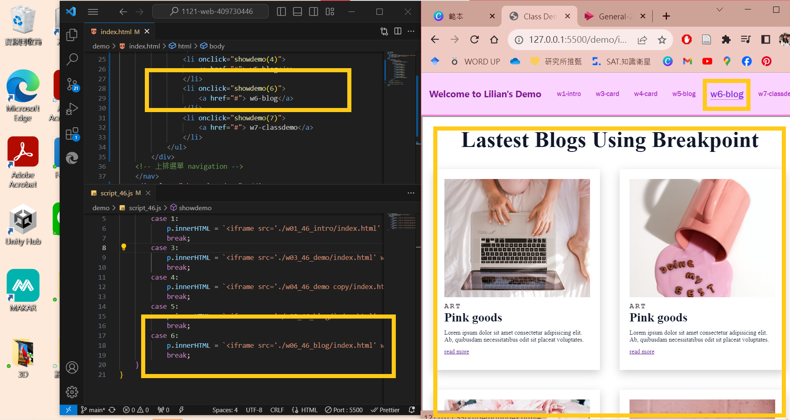
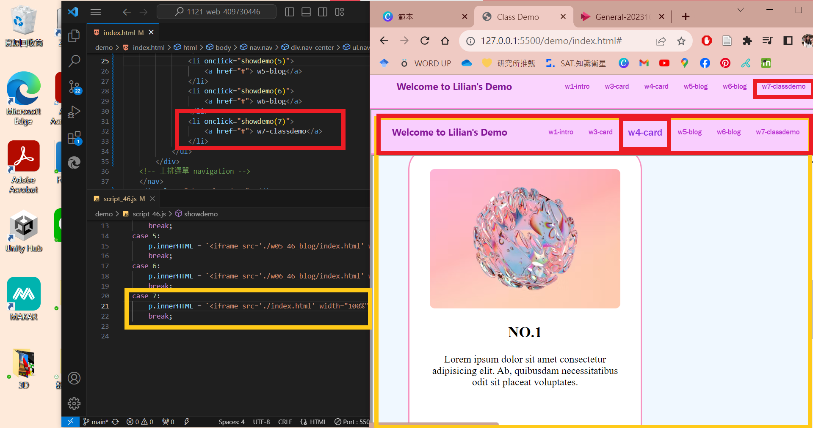
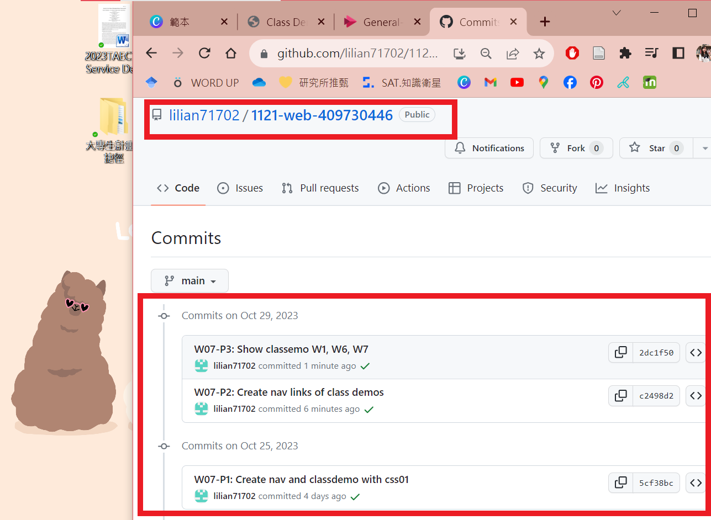

[My Github Repo](https://github.com/lilian71702/1121-web-409730446)

### W07-P1: Create nav and classdemo with css
 

 
```
5cf38bc lilian71702     Wed Oct 25 15:51:53 2023 +0800  W07-P1: Create nav and classdemo with css01
```

### W07-P2: Create nav links of class demos
 

 
```
c2498d2 lilian71702     Sun Oct 29 16:39:06 2023 +0800  W07-P2: Create nav links of class demos
```
### W07-P3: Show classemo W1, W6, W7
 

 

 
```
2dc1f50 lilian71702     Sun Oct 29 16:43:42 2023 +0800  W07-P3: Show classemo W1, W6, W7
```

### W07-P4: W7 git logs
 

 
```
git log --pretty=format:"%h%x09%an%x09%ad%x09%s" --after="2023-10-24"
 
2dc1f50 lilian71702     Sun Oct 29 16:43:42 2023 +0800  W07-P3: Show classemo W1, W6, W7
c2498d2 lilian71702     Sun Oct 29 16:39:06 2023 +0800  W07-P2: Create nav links of class demos
5cf38bc lilian71702     Wed Oct 25 15:51:53 2023 +0800  W07-P1: Create nav and classdemo with css01
 
```