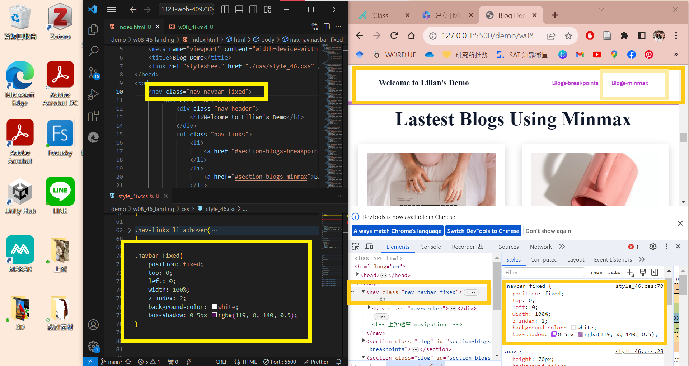

[My Github Repo](https://github.com/lilian71702/1121-web-409730446)

### W08-P1: show the section of #section-blogs-minmax with navbar-fixed css
 

 
```
34a8100 lilian71702     Sat Nov 4 11:05:50 2023 +0800   W08-P1: show the section of #section-blogs-minmax with navbar-fixed css
```

### W08-P2: use JavaScript to create a fixed navbar when mouse move down to some extent, remove when original nav appears
 

 

 
```
312d0dc htchung Wed Nov 1 14:06:35 2023 +0800   W08-P1: show the section of #section-blogs-minmax with navbar-fi
xed css
```