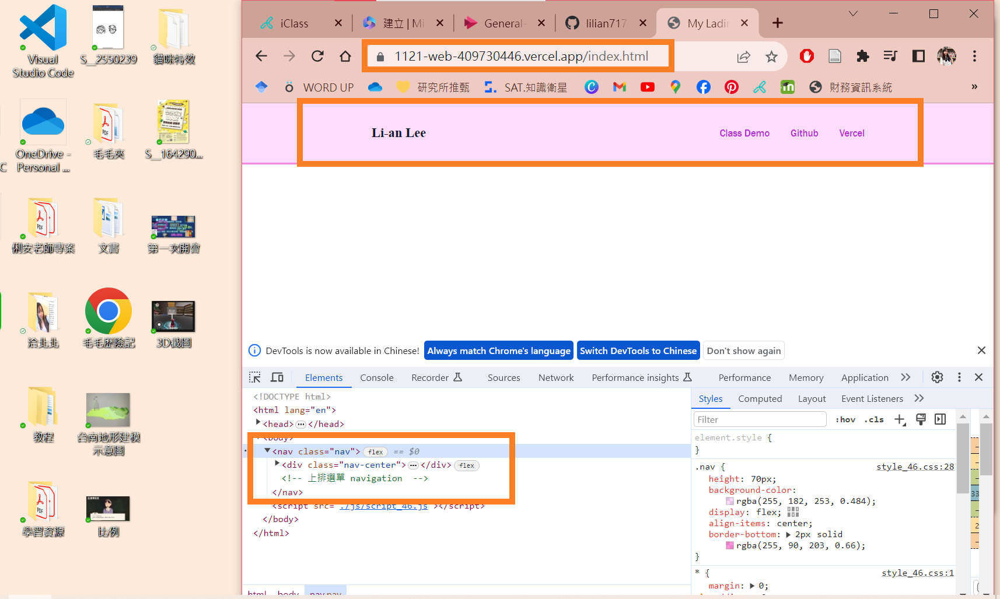
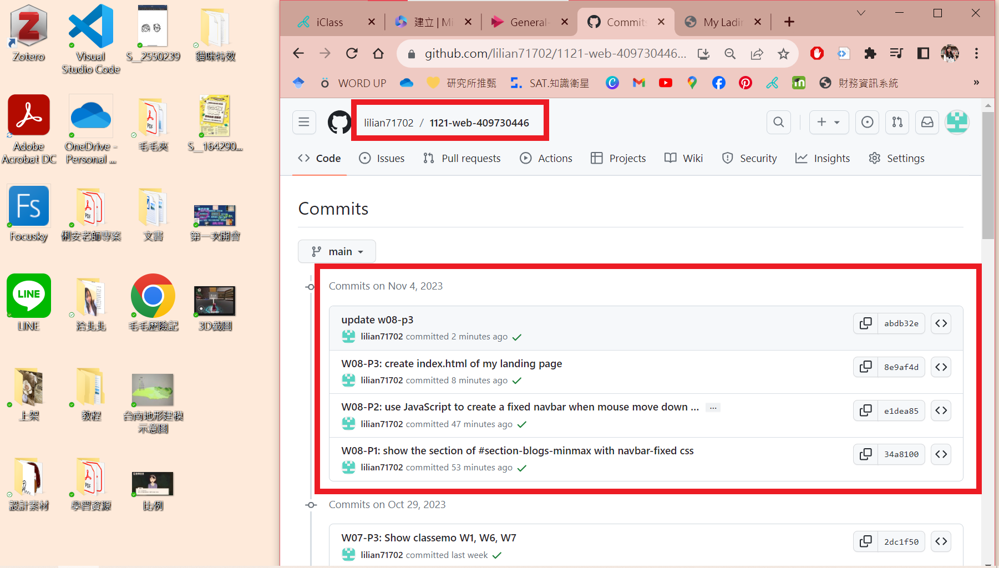

[My Github Repo](https://github.com/lilian71702/1121-web-409730446)

### W08-P1: show the section of #section-blogs-minmax with navbar-fixed css
 

 
```
34a8100 lilian71702     Sat Nov 4 11:05:50 2023 +0800   W08-P1: show the section of #section-blogs-minmax with navbar-fixed css
```

### W08-P2: use JavaScript to create a fixed navbar when mouse move down to some extent, remove when original nav appears
 

 

 
```
e1dea85 lilian71702     Sat Nov 4 11:11:14 2023 +0800   W08-P2: use JavaScript to create a fixed navbar when mouse move down to some extent, remove when original nav appears
```

### W08-P3: create index.html of my landing page
 

 
```
abdb32e lilian71702     Sat Nov 4 11:56:27 2023 +0800   update w08-p3
8e9af4d lilian71702     Sat Nov 4 11:50:40 2023 +0800   W08-P3: create index.html of my landing page
```

### W08-P4: W8 git logs
 

 
```
$ git log --pretty=format:"%h%x09%an%x09%ad%x09%s" --after="2023-10-31"
c70c579 lilian71702     Sat Nov 4 12:00:44 2023 +0800   W08-P4: W8 git logs
abdb32e lilian71702     Sat Nov 4 11:56:27 2023 +0800   update w08-p3
8e9af4d lilian71702     Sat Nov 4 11:50:40 2023 +0800   W08-P3: create index.html of my landing page
e1dea85 lilian71702     Sat Nov 4 11:11:14 2023 +0800   W08-P2: use JavaScript to create a fixed navbar when mouse move down to some extent, remove when original nav 
appears
34a8100 lilian71702     Sat Nov 4 11:05:50 2023 +0800   W08-P1: show the section of #section-blogs-minmax with navbar-fixed css
 
```