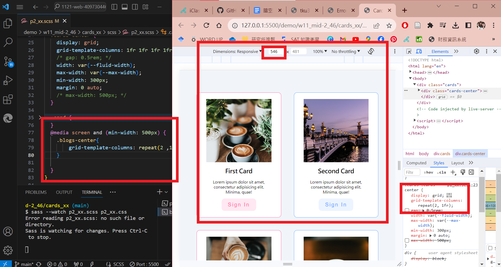

[My Github Repo](https://github.com/lilian71702/1121-web-409730446)

### W11-P1: Use scss to finish p1_xx
 

 
```
c8096ed lilian71702     Sun Nov 26 21:43:34 2023 +0800  W11-P1: Use scss to finish p1_xx
```
### W11-P2: convert css of w1-intro and w3-card into scss, and insert them into p5_xx.scss
 

 
```
e7a2702 lilian71702     Sun Nov 26 22:23:51 2023 +0800  W11-P2: convert css of w1-intro and w3-card into scss, and insert them into p5_xx.scss
```
### W11-P3: do p2_xx.scss responsive for p2_xx
 

 
```
71b0d93 lilian71702     Sun Nov 26 23:43:54 2023 +0800  W11-P3: do p2_xx.scss responsive for p2_xx
```

W11-P4: W11 git logs
 

 
```
git log --pretty=format:"%h%x09%an%x09%ad%x09%s" --after="2023-11-21"        
71b0d93 lilian71702     Sun Nov 26 23:43:54 2023 +0800  W11-P3: do p2_xx.scss responsive for p2_xx
e7a2702 lilian71702     Sun Nov 26 22:23:51 2023 +0800  W11-P2: convert css of w1-intro and w3-card into scss, and insert them into p5_xx.scss
c1763d8 lilian71702     Sun Nov 26 21:48:27 2023 +0800  Merge branch 'main' of https://github.com/lilian71702/1121-web-409730446
b4c2a2c lilian71702     Sun Nov 26 21:47:51 2023 +0800  W11-P1: Use scss to finish p1_xx
```