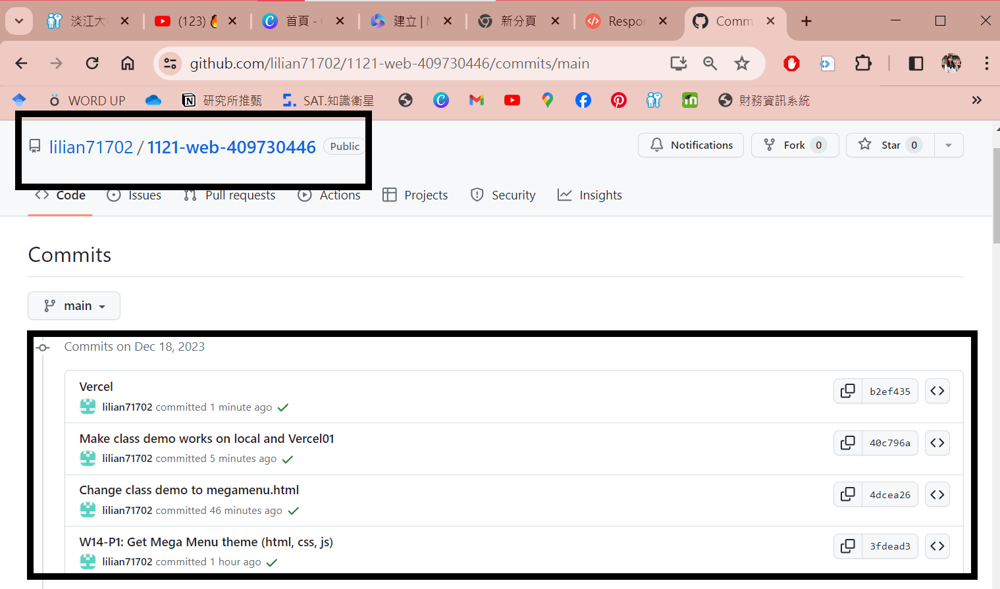

[My Github Repo](https://github.com/lilian71702/1121-web-409730446)

 ### W14-P1: Get Mega Menu theme (html, css, js)
 

 
```
3fdead3 lilian71702     Mon Dec 18 19:20:05 2023 +0800  W14-P1: Get Mega Menu theme (html, css, js)
```
### W14-P2: Change class demo to megamenu.html
 

 
```
4dcea26 lilian71702     Mon Dec 18 19:39:35 2023 
+0800   Change class demo to megamenu.html     
```

### W14-P3: Make class demo works on local and Vercel
 
##### => local
 

 

 
##### => Vercel
 

 
```
b2ef435 lilian71702     Mon Dec 18 20:25:01 2023 +0800  Vercel
40c796a lilian71702     Mon Dec 18 20:20:22 2023 +0800  Make class demo works on local and Vercel01
```
### W14-P4: W14 git logs
 

 
```
git log --pretty=format:"%h%x09%an%x09%ad%x09%s" --after="2023-12-12"
 
96d1a7c htchung Wed Dec 13 14:55:52 2023 +0800  W14-P3: Make class demo works on local and Vercel
2eb270d htchung Wed Dec 13 14:48:19 2023 +0800  W14-P3: Make class demo works
47618cb htchung Wed Dec 13 14:00:49 2023 +0800  add w14-p2.png from Vercel
f50df17 htchung Wed Dec 13 13:54:50 2023 +0800  W14-P2: Change class demo to megamenu.html
b9be311 htchung Wed Dec 13 13:39:26 2023 +0800  W14-P1: Get Mega Menu theme (html, css, js)
 
```
