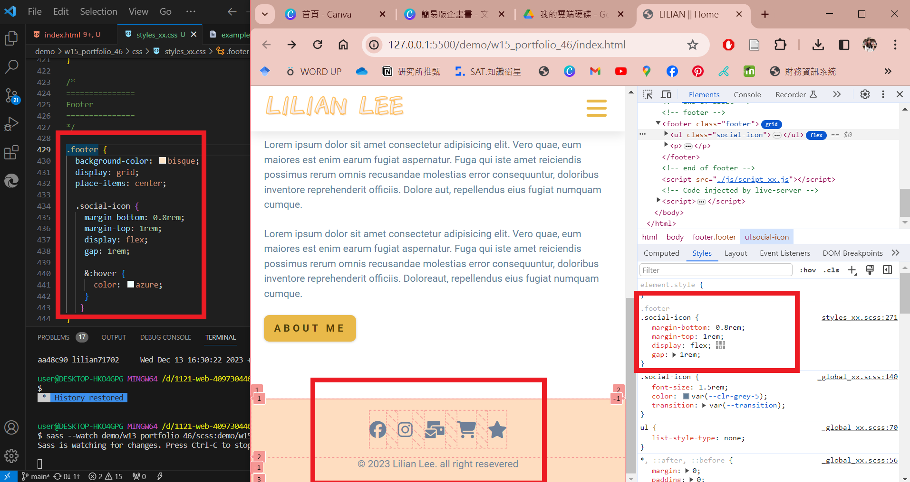
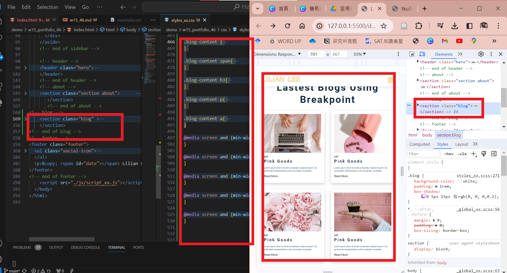
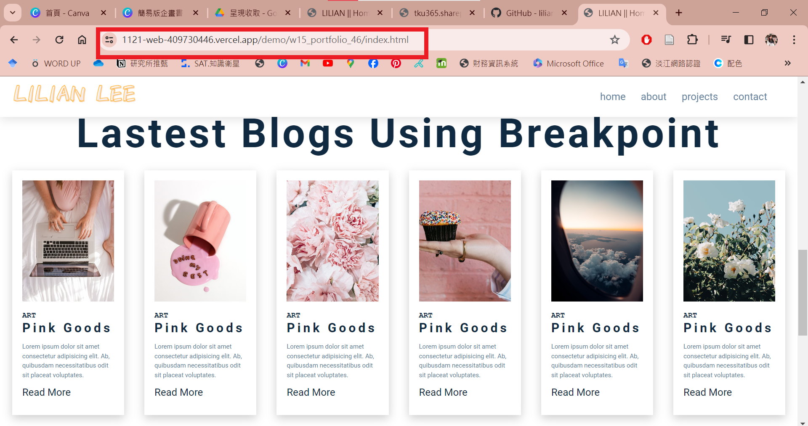
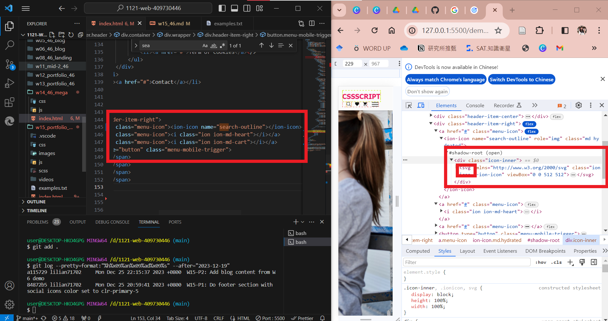

[My Github Repo](https://github.com/lilian71702/1121-web-409730446)

### W15-P1: Do footer section with social icons color set to clr-primary-5
 

 
```
84872b5 lilian71702     Mon Dec 25 20:59:41 2023 +0800  W15-P1: Do footer section with social icons color set to clr-primary-5
```

### W15-P2: Add blog content from W6 demo
 
#### => local
 

 
#### => Vercel
 

 
```
a115729 lilian71702     Mon Dec 25 22:15:37 2023 +0800  W15-P2: Add blog content from W6 demo
```

### W15-P3: Use ionicons 4.6.3 ana 7.1.0 both, show svg icons
 

 
```

```