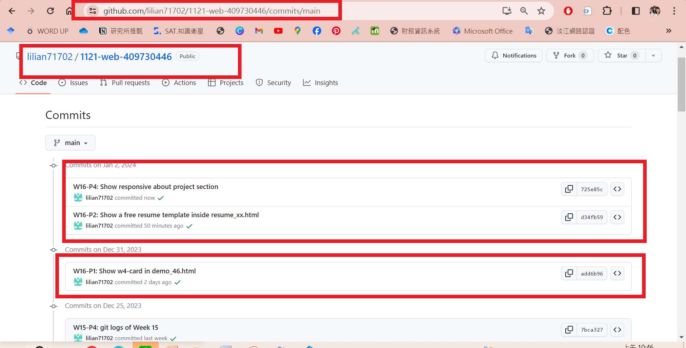

[My Github Repo](https://github.com/lilian71702/1121-web-409730446)

### W16-P1: Show w4-card in demo_46.html
 

 
```
add6b96 lilian71702     Sun Dec 31 16:23:21 2023 +0800  W16-P1: Show w4-card in demo_46.html
```

### W16-P2: Show a free resume template inside resume_xx.html
 

 
```
d34fb59 lilian71702     Tue Jan 2 09:56:10 2024 +0800   W16-P2: Show a free resume template inside resume_xx.html
```
### W16-P3: Show project section, one project per row
 

 
```
d34fb59 lilian71702     Tue Jan 2 09:56:10 2024 +0800   W16-P3: Show project section, one project per row
```

### W16-P4: Show responsive about project section
 

 
```
725e85c lilian71702     Tue Jan 2 10:45:27 2024 +0800   W16-P4: Show responsive about project section
```
 
### W16-P5: git logs of Week 16
 

 
```
git log --pretty=format:"%h%x09%an%x09%ad%x09%s" --after="2023-12-26"
d1d1ba5 lilian71702     Tue Jan 2 10:48:26 2024 +0800   W16-P5: git logs of Week 16
725e85c lilian71702     Tue Jan 2 10:45:27 2024 +0800   W16-P4: Show responsive about project section
d34fb59 lilian71702     Tue Jan 2 09:56:10 2024 +0800   W16-P3: Show project section, one project per row
d34fb59 lilian71702     Tue Jan 2 09:56:10 2024 +0800   W16-P2: Show a free resume template inside resume_xx.html
add6b96 lilian71702     Sun Dec 31 16:23:21 2023 +0800  W16-P1: Show w4-card in demo_46.html
```