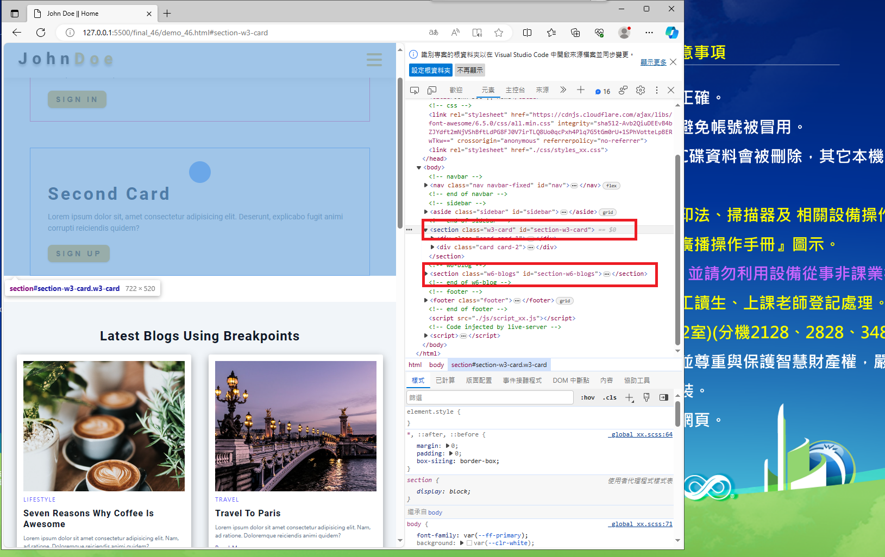

# (15%) 網頁程式設計 期莫上機考

##### 2024-1-3, at B218

#### Note:

1. 請不要發揮同學愛，作弊雙方除了本次考試 0 分外，平常分數另扣 20 分。
2. 請繳交 final_xx.md, final_xx.pdf，還有所有程式壓縮檔 (final_xx.zip)。
3. 老師將題目提供在 final_xx.md 檔案上，要實作的部分放在 final_htc.pdf 上。
4. 每一張圖片要有左側機房背景，圖片標註要跟老師所標註的類似。違者會依情節扣分。
5. 請自評分數，將每一題的 ? 填入分數，沒有填者，不會批改，以 0 分計算。

Your (Name, ID): (name, id)

##### 請自評每題分數

- P1 (10%): 10 分
- P2 (45%): ? 分
- P3 (25%): ? 分
- P4 (20%): ? 分

- 總分: ? 分

---

#### (10%) P1-1_xx: 請修改老師提供的 demo_xx.html，選單產生 w3-card-xx, w6-blogs-xx，分別連到 w3-card-xx, w6-blogs-xx 上

#### Your Answer:

##### => browser

##### => html and css code

---

#### (45%) P2_xx: 請產生 contact_xx.html，要包含 header, footer, 並插入老師提供的 profile theme 如下圖

##### => local browser

##### => Vercel

#### Your Answer:

##### => local browser

##### => Vercel

##### => git logs

##### => html and css code

---

#### (25%) P3_xx: 請從 index.html 複製一份，產生 final_xx.html，然後修改選單 Final_xx, Demo_xx, Profile_xx, Resume_xx 要能在這些 html 檔案中互相連接，sidebar 選單也要能夠互相連接

##### => final_xx.html nav 顯示

##### => final_xx.html sidebar 顯示

##### Your Answers:

##### => final_xx.html nav 顯示

##### => final_xx.html sidebar 顯示

##### => demo_xx.html nav 顯示

##### => demo_xx.html sidebar 顯示

##### => profile_xx.html nav 顯示

##### => profile_xx.html sidebar 顯示

##### => profile_xx.html sidebar code

---

#### (20%) P4_xx: 請針對 final_xx.html 內的 blogs 圖片，利用 breakpoints 斷點做響應式如下：

##### Your Answers:

##### => <500px 每行 1 張圖片，請以 498px 測試，並截圖如下：

##### => 500px~700px 每行 2 張圖片，請以 600px 測試，並截圖如下：

##### => 700px~900px 每行 3 張圖片，請以 800px 測試，並截圖如下：

##### => 900px~1100px 每行 4 張圖片，請以 1000px 測試，並截圖如下：

##### => 1100px~1300px 每行 5 張圖片，請以 1200px 測試，並截圖如下：

##### => 1300px 以上 每行 6 張圖片，請以 1400px 測試，並截圖如下：

##### => 跟響應式有關的 css

---
